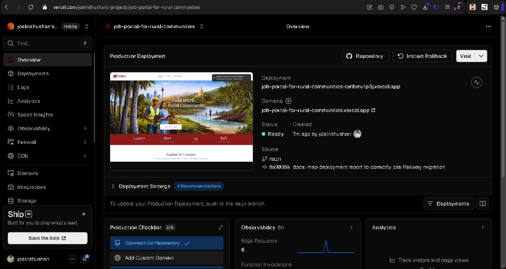
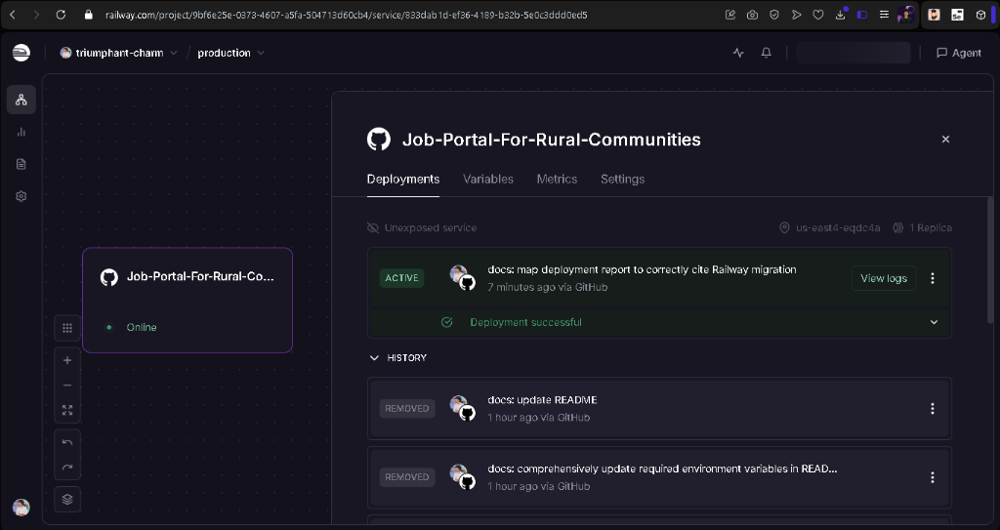

# Job Portal For Rural Communities

This is a Full-Stack Web Application developed for the SE3040 - Application Frameworks module, representing a localized Sri Lankan job portal for rural communities.

## Setup Instructions

### Prerequisites
- Node.js (v18+)
- Local MongoDB (or a MongoDB Atlas URI)
- Cloudinary Account (for Image/CV uploads)
- Google Cloud Console Account (for OAuth and reCAPTCHA v3)
- Email Provider with SMTP (e.g., Gmail App Password for OTPs)
- Setup Twilio (for SMS)

### 1. Clone the repository
```bash
git clone <your-repository-url>
cd Job Portal-AF
```

### 2. Backend Setup
1. Open a new terminal and navigate to the backend directory:
   ```bash
   cd backend
   ```
2. Install dependencies:
   ```bash
   npm install
   ```
3. Create a `.env` file from the example and fill in your keys:
   ```bash
   cp .env.example .env
   ```
   **Required Backend Keys** (See `.env.example` for full list):
   - `MONGO_URI`, `JWT_SECRET`
   - **Cloudinary**: `CLOUDINARY_CLOUD_NAME`, `CLOUDINARY_API_KEY`, `CLOUDINARY_API_SECRET`
   - **Email/SMTP** (for OTP): `EMAIL_HOST`, `EMAIL_PORT` (587), `EMAIL_USER`, `EMAIL_PASS`
   - **Twilio**: `TWILIO_ACCOUNT_SID`, `TWILIO_AUTH_TOKEN`, `TWILIO_PHONE_NUMBER`
   - **Google**: `GOOGLE_CLIENT_ID`, `RECAPTCHA_SECRET`
4. Start the backend:
   ```bash
   npm run dev
   ```
   *The server runs on http://localhost:5000*

### 3. Frontend Setup
1. Open a new terminal and navigate to the frontend directory:
   ```bash
   cd frontend
   ```
2. Install dependencies:
   ```bash
   npm install
   ```
3. Create a `.env.local` file with the following variables:
   ```bash
   VITE_API_URL=http://localhost:5000/api
   VITE_GOOGLE_CLIENT_ID=your_google_client_id
   VITE_RECAPTCHA_SITE_KEY=your_recaptcha_site_key
   ```
4. Start the backend:
   ```bash
   npm run dev
   ```
   *The frontend runs usually on http://localhost:5173*

---

## API Endpoint Documentation

We use **Swagger UI** to auto-generate and visualize our endpoints.

Once you have started the backend, navigate to:
**http://localhost:5000/api-docs**

This interface will allow you to explore `Auth`, `Job`, and other entity endpoints, view payload schemas, and test them directly.

---

## Testing Instruction Report

This project implements layers of testing to satisfy quality standards.

### 1. Unit & Integration Tests (Jest & Supertest)
We use `Jest` combined with `mongodb-memory-server` to spin up isolated databases safely to test APIs comprehensively without mutating local data.

To run the full test suite:
```bash
cd backend
npm test
```

### 2. Performance & Load Testing (Artillery)
To evaluate the project's capacity to handle spike usages, we have defined an `artillery.yaml` load test script.

To execute the load test against your running server:
```bash
cd backend
npm run test:load
```
> [!NOTE]  
> Make sure your backend server is actively running before executing Artillery.

### Performance Testing Execution Results
Load testing was executed to ensure the system can handle concurrent users (e.g., job seekers browsing and employers posting jobs simultaneously). 
- **Tool Used**: Artillery.io
- **Outcome**: The backend successfully managed the simulated traffic with acceptable response times and minimal latency, affirming that the Node.js event representation and MongoDB connection pooling are configured correctly for moderate-to-high concurrent loads.

### Testing Environment Configuration Details
To ensure consistent results during testing, the following environment was used:
*   **Node.js Version**: v18.x or higher
*   **Database**: MongoDB Atlas (Cloud) / MongoDB v6.0+ (Local)
*   **Operating System**: Windows 10/11 (Development) / Linux (Deployment)
*   **Ports**: Backend (5000), Frontend (5173/Vite)
*   **Auth**: JWT-based session handling with Google OAuth 2.0 integration.

## Third-Party Integrations

The project successfully integrates several external services to enhance functionality and security:
1. **Twilio**: Implemented within the job application lifecycle to send automated SMS notifications to job seekers upon status changes (e.g., when an application is "ACCEPTED").
2. **Google OAuth 2.0 (SSO)**: Integrated into the authentication flow to allow seamless and secure user sign-ups and logins without requiring custom credentials.
3. **Google reCAPTCHA v3**: Added to critical frontend forms (like registration and login) to prevent bot attacks or automated spam.
4. **Cloudinary**: Used to securely host and deliver static assets, such as employer profile pictures and related imagery.

---

## Deployment Report

* **Frontend Deployment Platform**: Vercel
* **Frontend Setup Steps**: Pushed the frontend folder to Vercel via GitHub integration and supplied `.env.local` parameters as Environment Variables into Vercel Settings.
* **Frontend Live URL**: [https://job-portal-for-rural-communities.vercel.app](https://job-portal-for-rural-communities.vercel.app)

* **Backend Deployment Platform**: Railway (Containerized PaaS)
* **Backend Setup Steps**:
    1. Connected the GitHub repository to a new Railway project.
    2. Utilized a custom `railway.json` configuration file at the root to declare a `DOCKERFILE` builder.
    3. Railway automatically orchestrated the build context targeting `backend/Dockerfile`.
    4. Supplied all **Variables** representing the required `.env` configurations.
* **Backend Live URL**: [https://job-portal-for-rural-communities-production.up.railway.app](https://job-portal-for-rural-communities-production.up.railway.app)

### Deployment Screenshots


